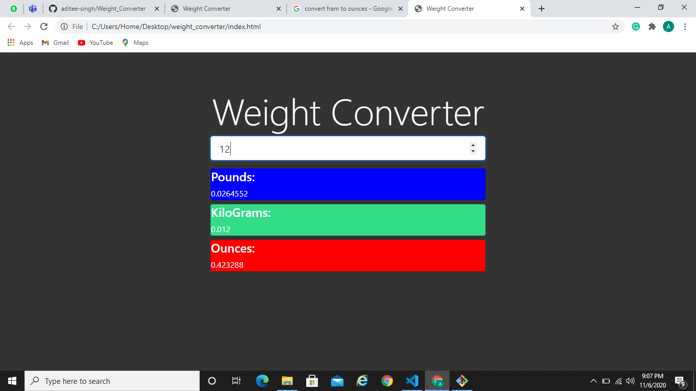

## Weight Converter

Designed a weight converter from scratch using HTML, CSS, Bootstrap, JavaSript.

### Webview

## Implementation

- This is a simple weight converter built using HTML, CSS, Bootstrap and JavaScript.

- It accepts weight in pounds and displays it's equivalent weight in Grams, Kilograms and Ounces.

## Instructions:

- Just open the index.html file.
 
 ## Technologies used

 - HTML
 - CSS
 - Bootstrap
 - JavaScript